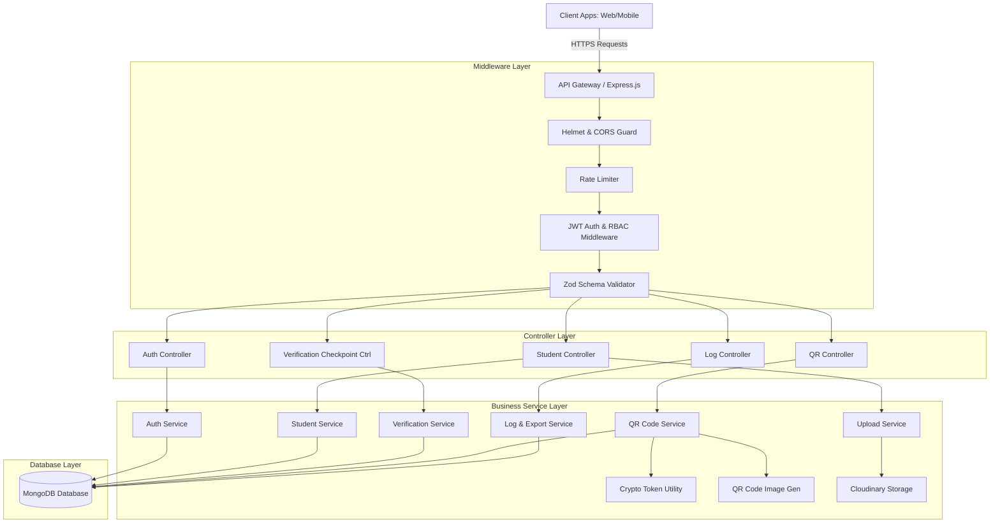
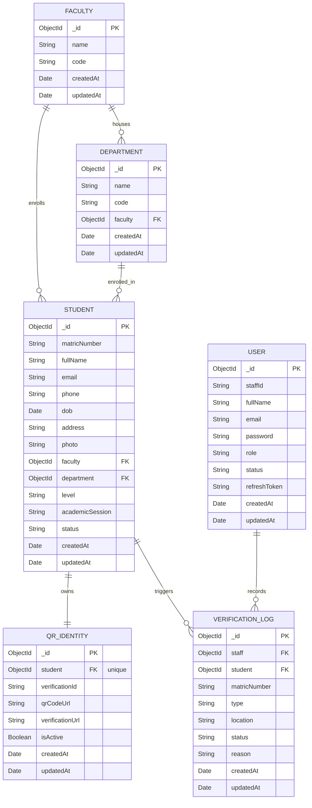

# System Design Document: Student Verification Information System (SVIS)

This document provides a comprehensive analysis of the system architecture, database design, and input/output schema of the Student Verification Information System (SVIS) backend codebase.

---

## 1. System Architecture

The Student Verification Information System (SVIS) is designed using a **Layered Model-View-Controller (MVC) and Service-Repository** architectural pattern. It separates concern levels strictly between web routing, request validation, business logic, data persistence, and helper utilities.

### 1.1 Architectural Pattern Overview
The application is structured into five distinct, decoupled layers:

1.  **Client Layer**: Web interfaces (Admin Dashboard, Officer Portals) and Mobile applications interact with the system via standard secure HTTPS REST APIs.
2.  **API Gateway & Middleware Layer (Express.js)**:
    *   **Security & Protection**: Configures HTTP headers using `helmet` (content security policy limits, resource policies), manages Cross-Origin Resource Sharing (`cors`), and limits request density via `express-rate-limit`.
    *   **Request Parsers**: Parses JSON payload, URL-encoded forms, and cookie headers (`cookie-parser`).
    *   **Session Guard (`protect`, `restrictTo`)**: Intercepts request headers and cookies, decodes JSON Web Tokens (JWT), verifies expiration, checks staff statuses, and validates role permissions before forwarding execution.
    *   **Zod Validations**: Validates parameters, query string filters, and JSON body values against strict schemas before controllers invoke business logic.
3.  **Controller Layer**: Mediates between routing rules and services. It parses sanitized inputs from Express request parameters and sends structured JSON outputs using standard wrappers.
4.  **Service Layer**: Encapsulates the core business logic of the system (e.g., cryptographic verification logic, QR code image generation via `qrcode`, Cloudinary upload handlers).
5.  **Database & Schema Layer (Mongoose & MongoDB)**: Executes query optimization, indexes relationships, validates structural constraints, and provides database connection listeners (auto-reconnect, error captures).

### 1.2 System Architecture Diagram
Below is the graphical system architecture diagram representing SVIS tiers and component flows:




---

## 2. Database Design

SVIS implements an optimized document schema using MongoDB. It structures relationships via MongoDB ObjectID references, enforces data integrity using schema validation rules, and ensures performant data retrieval using targeted database indexes.

### 2.1 Entity Relationship Diagram (ERD)
Below is the graphical representation of the database schema design:




### 2.2 Data Dictionary

#### 2.2.1 `Faculty` Collection
Stores details about the university faculties.

| Field Name | Type | Key / Index | Validations / Constraints | Description |
| :--- | :--- | :--- | :--- | :--- |
| `_id` | ObjectId | PK | Auto-generated | Unique identifier of the faculty. |
| `name` | String | Index (Unique) | Required, trimmed | Full name of the faculty (e.g., "Faculty of Science"). |
| `code` | String | Unique | Required, trimmed, uppercase | Abbreviation code (e.g., "FSC"). |
| `createdAt` | Date | - | System timestamp | Record creation timestamp. |
| `updatedAt` | Date | - | System timestamp | Record update timestamp. |

#### 2.2.2 `Department` Collection
Stores departments associated with a specific faculty.

| Field Name | Type | Key / Index | Validations / Constraints | Description |
| :--- | :--- | :--- | :--- | :--- |
| `_id` | ObjectId | PK | Auto-generated | Unique identifier of the department. |
| `name` | String | Index (Unique) | Required, trimmed | Full name of the department. |
| `code` | String | Unique | Required, trimmed, uppercase | Abbreviation code (e.g., "CSC"). |
| `faculty` | ObjectId | FK, Index | Required, References `Faculty` | Associated parent faculty. |
| `createdAt` | Date | - | System timestamp | Record creation timestamp. |
| `updatedAt` | Date | - | System timestamp | Record update timestamp. |

#### 2.2.3 `User` (Staff) Collection
Stores details of staff members (Librarians, Security Officers, Admins).

| Field Name | Type | Key / Index | Validations / Constraints | Description |
| :--- | :--- | :--- | :--- | :--- |
| `_id` | ObjectId | PK | Auto-generated | Unique identifier of the staff member. |
| `staffId` | String | Index (Unique) | Required, trimmed | Standard staff identification code. |
| `fullName` | String | - | Required, trimmed | Full name of the staff. |
| `email` | String | Unique | Required, trimmed, lowercase, valid email format | Work email address. |
| `password` | String | - | Required, minLength: 6, hashed (bcrypt) | Hashed password credentials (hidden by default). |
| `role` | String | - | Required, enum: `"Admin"`, `"Verification Officer"`, `"Librarian"`, `"Security Officer"` | RBAC permissions controller. |
| `status` | String | - | Enum: `"active"`, `"inactive"`, default: `"active"` | Activation status. |
| `refreshToken`| String | - | Optional, hidden by default | Cryptographic JWT refresh token string. |
| `createdAt` | Date | - | System timestamp | Record creation timestamp. |
| `updatedAt` | Date | - | System timestamp | Record update timestamp. |

#### 2.2.4 `Student` Collection
Stores student personal and academic details.

| Field Name | Type | Key / Index | Validations / Constraints | Description |
| :--- | :--- | :--- | :--- | :--- |
| `_id` | ObjectId | PK | Auto-generated | Unique identifier of the student. |
| `matricNumber`| String | Index (Unique) | Required, trimmed | Unique university registration number. |
| `fullName` | String | - | Required, trimmed | Student's full name. |
| `email` | String | Unique | Required, trimmed, lowercase, valid email format | Student's institutional email address. |
| `phone` | String | - | Required, trimmed | Student's mobile number. |
| `dob` | Date | - | Required | Date of birth. |
| `address` | String | - | Required, trimmed | Home or contact address. |
| `photo` | String | - | Required, URL string | Path to student photo (local uploads or Cloudinary). |
| `faculty` | ObjectId | FK, Index | Required, References `Faculty` | Reference to the student's Faculty. |
| `department` | ObjectId | FK, Index | Required, References `Department` | Reference to the student's Department. |
| `level` | String | - | Required, enum: `"100"`, `"200"`, `"300"`, `"400"`, `"500"` | Current study level. |
| `academicSession`| String | - | Required, trimmed | Current academic session (e.g., "2024/2025"). |
| `status` | String | Index | Enum: `"active"`, `"suspended"`, `"graduated"`, `"pending"`, default: `"active"` | Academic status. |
| `createdAt` | Date | - | System timestamp | Record creation timestamp. |
| `updatedAt` | Date | - | System timestamp | Record update timestamp. |

#### 2.2.5 `QRIdentity` Collection
Stores the relationship between students and their cryptographic QR identity keys.

| Field Name | Type | Key / Index | Validations / Constraints | Description |
| :--- | :--- | :--- | :--- | :--- |
| `_id` | ObjectId | PK | Auto-generated | Unique identifier of the QR record. |
| `student` | ObjectId | FK, Index (Unique) | Required, References `Student` | Reference to the associated student profile. |
| `verificationId`| String | Index (Unique) | Required, trimmed, random token | Cryptographic token embedded inside the QR image. |
| `qrCodeUrl` | String | - | Required | Base64 Data URI or CDN image file path. |
| `verificationUrl`| String | - | Required | URL encoded in the QR for scanning. |
| `isActive` | Boolean | - | Default: `true` | Status to toggle/revoke the QR code. |
| `createdAt` | Date | - | System timestamp | Record creation timestamp. |
| `updatedAt` | Date | - | System timestamp | Record update timestamp. |

#### 2.2.6 `VerificationLog` Collection
Audit database tracking all student checkpoint query scans and validations.

| Field Name | Type | Key / Index | Validations / Constraints | Description |
| :--- | :--- | :--- | :--- | :--- |
| `_id` | ObjectId | PK | Auto-generated | Unique identifier of the log. |
| `staff` | ObjectId | FK, Index | Optional, References `User` | The staff member performing the verification check. |
| `student` | ObjectId | FK | Optional, References `Student` | Matched student profile (if verification is found). |
| `matricNumber`| String | Index | Required, trimmed | Input registration/matric number scanned. |
| `type` | String | - | Required, enum: `"Matric"`, `"Student ID"`, `"QR Scan"` | Mode used to perform the query check. |
| `location` | String | - | Required, trimmed | Location checkpoint (e.g., "Library Gate"). |
| `status` | String | Index | Required, enum: `"verified"`, `"failed"` | Checkpoint verification outcome. |
| `reason` | String | - | Optional, trimmed | Reason detail if the verification failed. |
| `createdAt` | Date | Index | System timestamp (descending index) | Date and time of verification. |
| `updatedAt` | Date | - | System timestamp | Record update timestamp. |

---

## 3. Input and Output Design

SVIS REST APIs implement strict data exchange formats. All API requests use standardized input structures validated via **Zod**, and responses are wrapped in structured JSON templates with appropriate HTTP statuses.

### 3.1 Global Response Structures
Below is the graphical representation of the API Input/Output request validation and processing flow:


#### Success Wrapper Envelope (HTTP 200/201)
```json
{
  "success": true,
  "message": "Human-readable feedback explanation",
  "data": {}
}
```

#### Error Wrapper Envelope (HTTP 400/401/403/404/500)
```json
{
  "success": false,
  "message": "Specific error explanation detail",
  "errors": [
    {
      "field": "body.matricNumber",
      "message": "Matric number is required"
    }
  ],
  "stack": "Stacktrace (only provided in development environments)"
}
```

---

### 3.2 Authentication Endpoints

#### 3.2.1 Register Staff Account (`POST /api/v1/auth/register`)
*   **Access**: Public / Admin Restricted
*   **Input Design (JSON Body)**:
    ```json
    {
      "staffId": "UNI/ADM/001",
      "fullName": "Dr. Jane Doe",
      "email": "jane.doe@uni.edu",
      "password": "securePassword123",
      "role": "Admin"
    }
    ```
    *   *Validation Rules*: `staffId` is required, `email` must be a valid email string, `password` must be minimum 6 characters, `role` must be a valid enum item.
*   **Output Design (HTTP 201 Created)**:
    ```json
    {
      "success": true,
      "message": "Staff user registered successfully",
      "data": {
        "id": "60d0fe2c4f1a4e1790412850",
        "staffId": "UNI/ADM/001",
        "fullName": "Dr. Jane Doe",
        "email": "jane.doe@uni.edu",
        "role": "Admin",
        "status": "active"
      }
    }
    ```

#### 3.2.2 Login Staff Account (`POST /api/v1/auth/login`)
*   **Access**: Public
*   **Input Design (JSON Body)**:
    ```json
    {
      "staffId": "UNI/ADM/001",
      "password": "securePassword123"
    }
    ```
*   **Output Design (HTTP 200 OK)**:
    *   *Action*: Sets an HTTP-Only secure cookie named `refreshToken` containing the JWT refresh token.
    ```json
    {
      "success": true,
      "message": "Login successful",
      "data": {
        "user": {
          "id": "60d0fe2c4f1a4e1790412850",
          "staffId": "UNI/ADM/001",
          "fullName": "Dr. Jane Doe",
          "role": "Admin"
        },
        "accessToken": "eyJhbGciOiJIUzI1NiIsIn..."
      }
    }
    ```

---

### 3.3 Student Management Endpoints

#### 3.3.1 Create Student Profile (`POST /api/v1/students`)
*   **Access**: Protected (Role: Admin)
*   **Input Design (JSON Body)**:
    ```json
    {
      "matricNumber": "UNI/2026/0001",
      "fullName": "Adaeze Okafor",
      "email": "adaeze@student.edu",
      "phone": "+2348011112222",
      "dob": "2004-06-12",
      "address": "12 Campus Road",
      "photo": "http://localhost:5000/uploads/photo.jpg",
      "faculty": "60d0fe2c4f1a4e1790412800",
      "department": "60d0fe2c4f1a4e1790412801",
      "level": "300",
      "academicSession": "2024/2025"
    }
    ```
*   **Output Design (HTTP 201 Created)**:
    ```json
    {
      "success": true,
      "message": "Student created successfully",
      "data": {
        "id": "60d0fe2c4f1a4e1790412899",
        "matricNumber": "UNI/2026/0001",
        "fullName": "Adaeze Okafor",
        "email": "adaeze@student.edu",
        "status": "active"
      }
    }
    ```

#### 3.3.2 Query Student List (`GET /api/v1/students`)
*   **Access**: Protected (All Staff roles)
*   **Input Design (Query Parameters)**:
    *   `page`: Page number (Integer, default: `1`)
    *   `limit`: Page size limit (Integer, default: `10`)
    *   `search`: String to match name or matric number (Optional)
    *   `sortBy`: Sorting criteria (e.g. `fullName:asc`, Optional)
    *   `status`: Status filter (active/suspended/graduated/pending, Optional)
*   **Output Design (HTTP 200 OK)**:
    ```json
    {
      "success": true,
      "data": {
        "results": [
          {
            "id": "60d0fe2c4f1a4e1790412899",
            "matricNumber": "UNI/2026/0001",
            "fullName": "Adaeze Okafor",
            "email": "adaeze@student.edu",
            "status": "active",
            "level": "300"
          }
        ],
        "page": 1,
        "limit": 10,
        "totalPages": 1,
        "totalResults": 1
      }
    }
    ```

---

### 3.4 Verification Checkpoint Engine

#### 3.4.1 Verify Student (`POST /api/v1/verify`)
*   **Access**: Protected (All Staff roles)
*   **Input Design (JSON Body)**:
    ```json
    {
      "method": "matric",
      "identifier": "UNI/2026/0001",
      "location": "Main Library Gate"
    }
    ```
    *   *Validation Constraints*: `method` must be one of `"matric"`, `"id"`, or `"qr"`. `identifier` and `location` are required.
*   **Output Design (HTTP 200 OK - Successful Verification)**:
    ```json
    {
      "success": true,
      "message": "Student verified successfully",
      "data": {
        "verified": true,
        "status": "verified",
        "method": "Matric",
        "timestamp": "2026-06-05T03:00:00.000Z",
        "student": {
          "id": "60d0fe2c4f1a4e1790412899",
          "matricNumber": "UNI/2026/0001",
          "fullName": "Adaeze Okafor",
          "photo": "https://res.cloudinary.com/svis/image/upload/v1234/students/photo.jpg",
          "status": "active",
          "faculty": { "name": "Faculty of Science", "code": "FSC" },
          "department": { "name": "Computer Science", "code": "CSC" }
        }
      }
    }
    ```
*   **Output Design (HTTP 200 OK - Failed Verification e.g. Suspended Student)**:
    ```json
    {
      "success": true,
      "message": "Student verification failed",
      "data": {
        "verified": false,
        "status": "failed",
        "reason": "Student status is currently 'suspended'",
        "method": "Matric",
        "timestamp": "2026-06-05T03:02:00.000Z",
        "student": {
          "id": "60d0fe2c4f1a4e1790412899",
          "matricNumber": "UNI/2026/0001",
          "fullName": "Adaeze Okafor",
          "status": "suspended"
        }
      }
    }
    ```

---

### 3.5 QR Identity Endpoints

#### 3.5.1 Generate QR Code (`POST /api/v1/qr/generate`)
*   **Access**: Protected (Role: Admin)
*   **Input Design (JSON Body)**:
    ```json
    {
      "studentId": "60d0fe2c4f1a4e1790412899"
    }
    ```
*   **Output Design (HTTP 201 Created)**:
    ```json
    {
      "success": true,
      "message": "QR Identity created successfully",
      "data": {
        "verificationId": "5c9ebdf3e387c13db432a588b434a9ec",
        "qrCodeUrl": "data:image/png;base64,iVBORw0KGgo...",
        "verificationUrl": "http://localhost:5000/api/v1/qr/verify/5c9ebdf3e387c13db432a588b434a9ec"
      }
    }
    ```

#### 3.5.2 Verify QR Scan (`GET /api/v1/qr/verify/:verificationId`)
*   **Access**: Public (used by checking endpoints/scanners)
*   **Input Design (URL Parameters)**:
    *   `verificationId` (String, required)
*   **Output Design (HTTP 200 OK)**:
    *   *Action*: Logs verification status inside database log collection.
    ```json
    {
      "success": true,
      "message": "Student verified successfully",
      "data": {
        "verified": true,
        "student": {
          "id": "60d0fe2c4f1a4e1790412899",
          "matricNumber": "UNI/2026/0001",
          "fullName": "Adaeze Okafor",
          "status": "active"
        }
      }
    }
    ```
